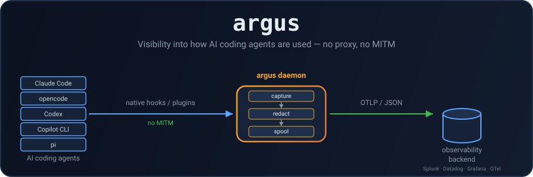
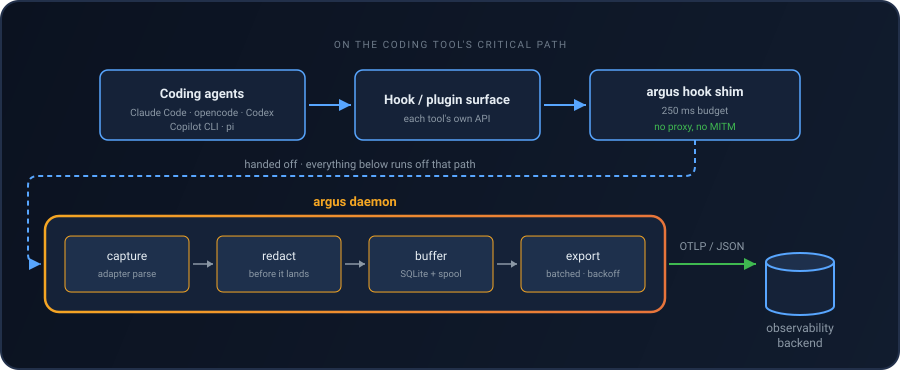

<p align="center">
  
</p>

<p align="center">
  <a href="https://github.com/boogy/argus/actions/workflows/ci.yml"></a>
  <a href="https://github.com/boogy/argus/releases/latest"></a>
  <a href="LICENSE"></a>
</p>

**See what your AI coding agents actually did — every prompt, tool call, file, host, and credential, captured locally and shipped to your observability stack.**

A single cross-platform Rust binary that gives security/platform teams visibility
into how AI coding agents are used: which prompts are sent, which tools/files/FQDNs
they touch, which skills/subagents run — captured through each tool's native
hook/plugin surface (no TLS proxying, no MITM) and exported as OTLP/JSON logs to
any observability backend (Splunk, Datadog, Grafana, an OTel Collector, ...).

Supports **Claude Code**, **opencode**, **OpenAI Codex**, **GitHub Copilot CLI**, and **pi**.

<p align="center">
  
</p>

The hook shim is the only thing on the host tool's critical path (a 250ms
deadline, falling back to an on-disk spool if the daemon isn't reachable); the
daemon does everything else off that path — adapter parsing, redaction,
durable buffering, and batched export with backoff.

## Features

|     | Feature                                   |                                                                                                                                                      |
| --- | ----------------------------------------- | ---------------------------------------------------------------------------------------------------------------------------------------------------- |
| 🪝  | **Native hook/plugin capture**            | Reads each tool's own hook/plugin payloads — no TLS proxying, no MITM.                                                                               |
| 🔒  | **Redacted before it leaves the machine** | Built-in secret patterns scrub API keys, tokens, and credentials before anything touches disk or network.                                            |
| 📡  | **OTLP/JSON export, offline-first**       | Durable SQLite buffer, batched export with backoff to any OTel-compatible backend.                                                                   |
| 📂  | **Opt-in file-content capture**           | Records what a `Write`/`Edit`/patch actually changed, with hashing, size caps, and binary/exclude filters.                                           |
| 🌐  | **Network & MCP visibility**              | Extracts FQDNs/endpoints from tool calls and names the MCP server each call reached.                                                                 |
| ☁️  | **Cloud identity, never credentials**     | Captures the AWS/Azure/GCP/K8s/Vault identity an agent was holding — role, account, project — and only the _names_ of credential variables in scope. |
| 🏢  | **Three independent install scopes**      | Per-user, per-repository, and administrator-managed (`--managed`) installs.                                                                          |
| 📶  | **Remote fleet config**                   | ETag-conditional polling of a central policy URL, cached to disk so it still applies offline; always wins over the local file.                       |
| 🛡️  | **Self-integrity checks**                 | `argus check` verifies hooks/plugins haven't been tampered with, silently disabled, or pointed at a binary that isn't argus, for fleet monitoring. See the [threat model](docs/threat-model.md). |

## Quick start

On macOS (and Linux) via Homebrew:

```bash
brew install boogy/tap/argus
argus install    # detects installed tools, wires hooks/plugins/config
```

Or from source, on any supported platform:

```bash
cargo install --path .    # or grab a release binary
argus install
```

`--dry-run` prints the plan, and the detection signals behind it, without
writing anything.

Point the daemon at your collector — edit `<data-dir>/config.toml`:

```toml
[export]
otlp_endpoint = "https://otel-collector.internal:4318"
```

(`<data-dir>` is `~/Library/Application Support/argus` on macOS,
`~/.local/share/argus` on Linux, `%APPDATA%\argus` on Windows.)

For fleet-wide rollout, skip local `config.toml` entirely and set:

```toml
[remote]
url = "https://config.internal/argus.toml"
```

The daemon polls that URL (ETag-conditional) and caches the result to disk, so
policy still applies offline after the first successful fetch. Remote config
always wins over the local file.

Run `argus status` any time to see the resolved config, buffered event count,
and whether the daemon is reachable. Run `argus uninstall` to cleanly remove
all wiring.

There are three install scopes, and they are independent — a machine can carry
all three at once:

| Command                         | Writes into                                     | Who can remove it       |
| ------------------------------- | ----------------------------------------------- | ----------------------- |
| `argus install`                 | this user's config (`~/.claude`, `~/.codex`, …) | the user                |
| `argus install --project <dir>` | a repository (`<dir>/.codex/hooks.json`)        | anyone who can push     |
| `argus install --managed`       | an administrator-owned system root              | root/Administrator only |

Full install detail, remote fleet config, and the `--managed` layer file-by-file:
see [Installation](docs/installation.md).

## Documentation

The [docs/](docs/README.md) index routes by intent (evaluating, installing,
operating, extending). Individual pages:

| Doc                                                                  | What's in it                                                                                        |
| -------------------------------------------------------------------- | --------------------------------------------------------------------------------------------------- |
| [Architecture](docs/architecture.md)                                 | Hook shim → daemon → buffer → export pipeline; the data directory.                                  |
| [Per-tool fidelity](docs/tool-support.md)                            | Signal-by-signal comparison across all five host tools.                                             |
| [Configuration](docs/configuration.md)                               | Remote fleet config, the full `config.toml` key reference, environment variables.                   |
| [Capture and enrichment](docs/capture.md)                            | File-content capture, network/FQDN extraction, MCP server identity, cloud identity.                 |
| [Privacy and redaction](docs/privacy.md)                             | Built-in redaction, metadata-only mode, the un-redacted hand-off spool.                             |
| [Installation](docs/installation.md)                                 | Quick start, install scopes, the machine-wide `--managed` layer.                                    |
| [Troubleshooting](docs/troubleshooting.md)                           | `argus status` / `argus check` output, settings that silently stop hooks firing, known limitations. |
| [Adding a new tool](docs/adding-a-tool.md)                           | The adapter/hook-or-plugin/install pieces a new integration needs.                                  |
| [Querying the local event database](docs/querying-local-database.md) | Where `events.db` lives per platform, its schema, and a query cookbook.                             |
| [Telemetry gap review](docs/telemetry-gaps.md)                       | Standing review of what each surface could still capture but doesn't yet.                           |

## Known limitations

- Windows has no restart-on-exit supervisor — the Startup-folder script runs the
  daemon at logon and a hook restarts it mid-session. launchd and systemd do
  keep it alive.
- Remote config is trusted over HTTPS; no detached-signature verification yet.
- Bash tool parsing reads redirection targets and six file verbs, not the file
  argument of every program.
- No Claude Code transcript-path mining for token/model usage stats.
- The hand-off spool holds un-redacted payloads while the daemon is down.
- Claude Code `MessageDisplay` and `FileChanged` are deliberately not wired.

Full list, with links to the relevant detail: [Known
limitations](docs/troubleshooting.md#known-limitations).

## License

Apache-2.0. See [LICENSE](LICENSE).
