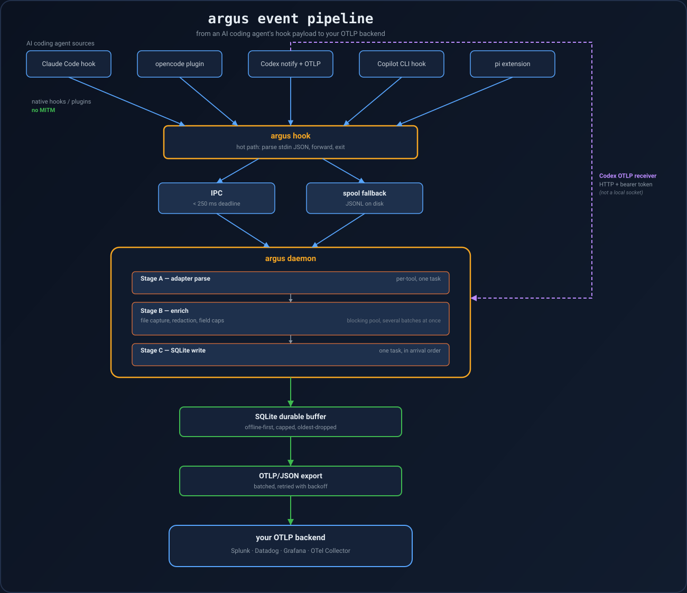

# Architecture

How an event gets from a coding agent's hook payload to your observability
backend: the hook shim on the host tool's critical path, the daemon doing the
real work off that path, and the install layer that wires the two together
per tool.

**On this page:** [Hook shim](#hook-shim) · [opencode plugin](#opencode-plugin)
· [Daemon](#daemon) · [Codex OTLP receiver](#codex-otlp-receiver) ·
[Install](#install) · [Repository-level wiring](#repository-level-wiring) ·
[Data directory](#data-directory)

  

## Hook shim

`argus hook` is the only thing on the host tool's critical path: it never
blocks the host tool and never fails loudly. A broken hook must not break
Claude Code, opencode, or Codex.

It tries the daemon first, over a local socket, with a 250ms deadline:

- **Unix** — a Unix domain socket at `<data-dir>/argus.sock`.
- **Windows** — a named pipe `\\.\pipe\argus-<id>`, where `<id>` is a hash of
  the data directory. The pipe namespace is machine-global and flat, so
  without the hash every account on the machine would share one endpoint and
  hook payloads would reach whichever daemon bound first.

The daemon refuses to bind an endpoint another account owns rather than
reporting it as "already running" — a squatted socket that looks like a
healthy install is a silent kill switch. The endpoint is also reachable by
this account only:

- **Unix** — mode `0600` in a `0700` directory.
- **Windows** — a protected DACL granting one SID, replacing the default pipe
  descriptor's read access for Everyone and for the anonymous account.

On timeout or daemon-not-running, the shim falls back to writing a JSONL
spool file and autospawns the daemon.

### Timeouts

Every hook entry argus writes carries an explicit timeout, because the
defaults are written for hooks that do work: Copilot reads an omitted
`timeoutSec` as 30 seconds. Ten is what argus writes — forty times the shim's
own 250ms deadline, so it is slack, not a requirement.

Shutdown hooks (Codex `SessionEnd`, Copilot `sessionEnd`) get three seconds:
there, the timeout is time the user spends watching the CLI refuse to exit,
and an event lost at shutdown is the cheapest one to lose — the shim has
already spooled it.

## opencode plugin

The opencode plugin talks to the same socket from inside the editor process,
so it carries the daemon fallback itself rather than relying on the shim.

### Avoiding duplicate sends

An event the socket will not take is handed to `argus hook`, which spools it.
"Will not take" is deliberately not the same as "has not sent yet": a stream
write returns `false` once the stream is over its high-water mark, but the
frame is queued and still goes out. Sending it again through the fallback is
how one tool call became two rows.

The plugin instead tracks unflushed bytes and diverts only what it has not
already queued, capped at 1 MiB so a daemon that stops reading cannot grow
the editor's memory without bound. `tests/plugin/` drives the real plugin
against a stalled reader to hold that line — the pre-fix shim scores 400
envelopes for 200 events there.

### Shared transport implementation

That transport is not opencode's own. It lives in `plugins/shared/transport.ts`
and is joined onto each host's adapter half at build time, so every
TypeScript plugin argus installs derives its socket path, its FNV
discriminator and its envelope frame from one copy.

A second copy would not fail loudly if it drifted: the plugin would still
load and still forward, it would just stop finding the daemon and spawn a
process per event forever. The join happens in Rust rather than through a
relative import because a plugin host loads exactly one file, and an import
that resolves here need not resolve in someone else's config directory. The
two halves are checked as one: `check` looks for a marker from each, and the
plugin test runs the composed file rather than either fragment.

### File-identity verification

Because the composed file is embedded in the binary rather than read from
disk at install time, `check` can hold the installed copy to it exactly: the
plugin and the pi extension must be byte-identical to what this binary
writes, and a mismatch is reported with both sha256 prefixes.

Markers alone would not be enough for a file a runtime loads as code — every
marker survives having a payload appended after it — and the same comparison
names the quieter case: a plugin left over from an older argus that keeps its
markers while speaking an older frame to the daemon.

### Plugin directory discovery

opencode discovers plugins under `plugin/` _or_ `plugins/` — both spellings
are in its own documentation — so argus writes into whichever the config
directory already has, preferring the one that already holds an `argus.ts`.

A reinstall therefore updates the copy opencode is loading instead of leaving
a stale one in the other directory, and a first install joins the user's
plugins rather than creating a second, one-file collection beside them.
`check` and `uninstall` resolve the same way.

### Working directory and call IDs

Two fields the plugin is the only possible source of:

- **Working directory** — opencode hands it to a plugin once, at load, and
  never repeats it on an event. Without the plugin sending it, every opencode
  event was `cwd: null` and invisible to anything scoped to a repository.
- **Tool `callID`** — what pairs a `before` with its `after`.

Both are tested: `tests/plugin/opencode_payload.mjs` asserts the plugin puts
them on the wire, because a field the plugin stops sending breaks no Rust
test on its own — the adapter reads `None` and the column just goes quietly
empty.

### Usage event

opencode is also the one surface that reports what a turn cost, so it is the
one that gets a `usage` event: model, provider, the five token counts and the
host tool's own cost figure, each its own field rather than a JSON blob —
spend-per-session has to be a query for the number to ever get looked at.
Token volume is also the cheapest thing that separates a session doing work
from one looping on the same failure.

The streaming filter lives in the plugin: `message.updated` fires on every
delta and only the last one carries totals, so the plugin forwards it only
once the turn is marked complete, and the partial receipts never leave the
editor process. `meta.model` is `provider/model`, because the same model
name is served by more than one provider and which one saw the turn is the
question being asked.

### Forwarded-event audit

The forwarded-event list is checked against opencode's own `Event` union
rather than against documentation.

That audit removed `permission.asked`, which never existed: it had a
`BUS_FORWARD` entry, an adapter arm and a fixture — three consistent
artefacts describing an event opencode has never emitted — and it held the
only mapping to a `requested` permission action, so no query for permission
requests on opencode ever matched. `permission.updated` _is_ the ask, and now
says so; it also carries the `callID` of the tool call it gates, so the
prompt and the call join.

A test walks `BUS_FORWARD` out of the plugin source and asserts each name
reaches a real adapter arm, because the failure mode is silent: a forwarded
event with no arm is not dropped, it arrives as an unqueryable blob that
still counts as an event in every report.

The same audit added events that were genuinely missing:

- **`pty.created` / `pty.exited`** — a pty is a command with a pid that never
  passes through `tool.execute.*`, the one way to run something in opencode
  and leave no trace in the tool record. These become a `pre`/`post`
  `ToolUse` pair joined by the pty's id, with FQDNs scanned from the program
  _and_ its arguments. Without them, pty sessions would be command
  executions invisible to every query about command executions.
- **`message.removed`** — the only notice that part of the transcript
  stopped existing.
- **`vcs.branch.updated`** — which branch a session's `cwd` was on, which is
  what makes a file edit mean anything.

`lsp.*`, `message.part.*`, `tui.*` and `installation.update-available` stay
out: high-frequency, UI-only, or a poll result rather than a state change.

## Daemon

`argus daemon` does everything else off the hook shim's critical path:
per-tool adapter parsing → secret redaction → durable SQLite buffering →
batched OTLP/JSON export with exponential backoff. It also drains the spool
directory and polls remote config.

### Export retries and refusals

Export is at-least-once: a batch is deleted only after a 2xx, so a collector
outage costs nothing.

A **refusal** is settled differently from an outage. A `4xx` other than
`408`/`429` means the collector read the request and said no — an oversized
record, a schema a validator rejects, a revoked key — and re-sending it can
only fail again. Retrying forever would park that batch at the head of the
queue while newer events pile up behind it and are eventually evicted to
make room: the one refused batch would cost every event after it.

So a refused batch is dropped, and a `loss` event naming the status and the
collector's own error text takes its place in the queue — which is what
makes the gap visible at the far end rather than an absence nobody can date.

## Codex OTLP receiver

The Codex OTLP receiver is the one input that is not a local socket, because
Codex exports over HTTP.

Loopback is not an authentication boundary — every process on the machine,
under any account, can post to `127.0.0.1` — so the receiver requires a
bearer token: 256 bits generated at install into
`<data-dir>/codex-otlp.token` (mode `0600`, in the `0700` data directory) and
copied into Codex's `[otel]` exporter headers. Without it, anything on the
box could write fabricated prompts and tool calls into the record of what
the agents did.

A post without the token gets `401` and is not parsed, forwarded or
buffered. If Codex telemetry stops arriving, its `config.toml` is carrying a
token this install does not know (a restored profile, a wiped data
directory); the daemon logs this once and `argus install` re-wires it.

## Install

`argus install` detects installed tools from four independent signals and
idempotently wires each one — see the [per-tool fidelity
table](tool-support.md). `--dry-run` prints planned changes, and the signals
behind them, without writing anything.

| Signal       | What it reads                                                                                                                                                                                                  |
| ------------ | -------------------------------------------------------------------------------------------------------------------------------------------------------------------------------------------------------------- |
| `config dir` | `~/.claude`, `~/.codex`, `~/.copilot`, `~/.pi/agent`, `$XDG_CONFIG_HOME/opencode` (`%APPDATA%\opencode` on Windows), honouring `COPILOT_HOME`/`CODEX_HOME`                                                     |
| `binary`     | the tool's binary on `PATH` **and** in the per-user prefixes a hook's `PATH` often omits (`~/.local/bin`, `~/.npm-global/bin`, `%APPDATA%\npm`, scoop shims, …); on Windows the candidates come from `PATHEXT` |
| `npm`        | that binary's real path resolving inside `node_modules/<package>/`                                                                                                                                             |
| `brew`       | …or inside `Cellar/<formula>/`                                                                                                                                                                                 |

A config directory only appears once a tool has been _run_, so binary and
package signals are what let argus wire a freshly installed agent.

In the other direction, a binary whose name is an ordinary word (`codex`) is
never proof by itself — it counts only when a config dir or package
provenance corroborates it, otherwise a machine that has never had Codex
gets wired and then reported as broken forever.

## Repository-level wiring

`argus install --project <dir>` writes `<dir>/.codex/hooks.json` and nothing
else, so anyone running Codex inside that checkout is captured without a
per-machine hook install. `uninstall --project <dir>` reverses it, and
`check --project <dir>` verifies it alongside the user-level wiring — a
repository nothing wired is silent rather than broken.

Three things this is not:

- **Not a way to ship settings.** Machine-level config stays out of the
  repository, most of all Codex's `[otel]` block, whose `authorization`
  header carries this install's receiver token — committing that publishes
  the one secret standing between the audit trail and anything else on the
  machine that can reach loopback.
- **Not self-contained.** The hook command names the `argus` binary, which
  still has to be on `PATH` on every machine that clones the repository, and
  Codex loads a repository's hooks only once that `.codex/` layer is trusted
  there, per user, via `/hooks`.
- **Not enforcement.** Anyone who can push to the repository can also delete
  what it writes. It is a convenience for teams that already ship argus in
  their image. Project hooks are additive in Codex, so this never competes
  with a user-level install; the two both run.

Only Codex is wired this way today. Claude Code has an equivalent project
layer (`<repo>/.claude/settings.json`) that is simply not wired yet;
Copilot's hook file is a machine-level path with no repository equivalent,
and the opencode plugin is loaded from the user's config directory, not
contributed by a repository.

## Data directory

`<data-dir>` — the buffer, spool, socket, config and Codex token all live
here:

| Platform | Data directory                        |
| -------- | ------------------------------------- |
| macOS    | `~/Library/Application Support/argus` |
| Linux    | `~/.local/share/argus`                |
| Windows  | `%APPDATA%\argus`                     |

`ARGUS_DATA_DIR` overrides it. See [Querying the local event
database](querying-local-database.md) for the buffer's schema and location,
and [Privacy](privacy.md) for why the whole directory should be treated as
sensitive.

---

Back to the [project README](../README.md).
